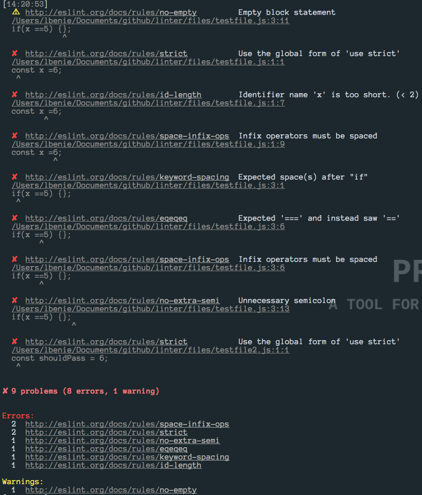

# pretty-javascript

Pretty-JavaScript is Coveo's JavaScript linter used to lint pure JavaScript
files with eslint.

[](https://travis-ci.org/coveo/pretty-javascript)
[](https://david-dm.org/coveo/pretty-javascript)
[](https://david-dm.org/coveo/pretty-javascript#info=devDependencies)
[](https://github.com/coveo/pretty-javascript/releases/)
[](https://www.npmjs.org/package/pretty-javascript)
[](https://www.npmjs.org/package/pretty-javascript)
[](https://github.com/coveo/pretty-javascript/blob/master/LICENSE)

## Usage

Install `pretty-javascript` with `npm`

```sh
  npm install --save-dev pretty-javascript
```

Add pretty-javascript to your gulp pipeline

```js
  var lint = require('pretty-javascript');

  gulp.task('linter', function() {
    gulp
      .src('src/**/*.js')
      .pipe(lint());
  });
```

Extends coveo rules in your `.eslintrc` file. Example [here](https://github.com/coveo/eslint-config-coveo#usage).

## Example

Watch for linter errors/warnings



[](http://forthebadge.com)
[](http://forthebadge.com)
[](http://forthebadge.com)
